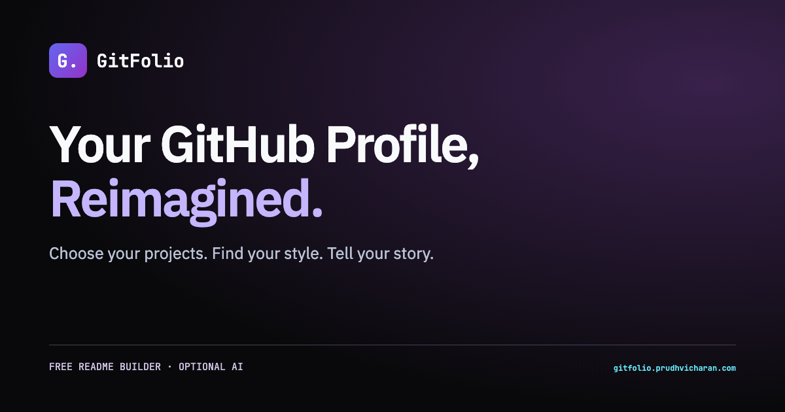

<div align="center">
  <a href="https://gitfolio-eight.vercel.app/">
    
  </a>

  <br />

  **Turn public GitHub work into a profile README that feels intentional.**

  Import your repositories, shape the story, and export polished Markdown.
  No GitFolio account. AI is optional.

  [Open GitFolio](https://gitfolio-eight.vercel.app/) · [Explore the code](https://github.com/Prudhvicharan/gitfolio) · [Report an issue](https://github.com/Prudhvicharan/gitfolio/issues)
</div>

## From repositories to a profile worth reading

GitFolio turns scattered public profile data into a clear developer narrative.
It keeps the fast parts automatic while leaving every published word under your
control.

1. **Import** a public GitHub profile and choose up to eight repositories.
2. **Create** the story manually or ask Gemini for a complete first draft.
3. **Style, review, and export** a ready-to-publish `README.md`.

## Designed around the final README

| | Experience |
|---|---|
| **Three real directions** | Editorial is restrained and text-led. Studio balances story and proof. Aurora adds motion and a more expressive composition. |
| **Story before decoration** | Project narratives, focus areas, working principles, goals, skills, and personality form one coherent profile. |
| **Reliable proof** | Repository metrics, language mix, topics, and featured work render from imported data instead of fragile statistics services. |
| **Optional AI** | Gemini reduces typing, then returns the result to an editable review step. Nothing is published automatically. |
| **Safe exploration** | A fictional, read-only demo shows the complete experience without credentials, exports, or misleading setup actions. |

### What the builder includes

- Live sanitized Markdown preview and raw Markdown review.
- Native profile facts, engineering footprint, language mix, and project cards.
- Curated headers, palettes, skill icons, typing lines, social links, and personal notes.
- Live follower and owned-star signals backed by stable native profile facts.
- Automatic refresh recovery plus optional longer-term device saving.
- Copy and download actions with a concise GitHub publishing guide.
- Opt-in contribution snake and 3D landscape workflows, each gated by a setup checklist so broken assets never enter the export.
- Clear failure states for GitHub imports, AI requests, storage, and optional image providers.

## Run locally

Requires Node.js **22.18 or newer**.

```bash
git clone https://github.com/Prudhvicharan/gitfolio.git
cd gitfolio
npm ci
npm run dev
```

Open `http://localhost:5173`. No environment file or server credential is required.
Users who choose AI enter their own Gemini API key directly in the Review step.

### Verify a change

```bash
npm test
npm run lint
npm run build
npm run preview -- --host 127.0.0.1
```

`npm run build` checks TypeScript, builds the client and SSR bundle, and prerenders
the landing page. The production site serves static files from `dist`; GitFolio has
no application server.

## How it works

```text
GitHub public API
       ↓
Repository selection
       ↓
Manual writing or optional Gemini draft
       ↓
Editorial · Studio · Aurora composition
       ↓
Sanitized preview → README.md
```

The wizard, Markdown renderer, and Gemini SDK load only when needed. Core profile
insights use generated Markdown and HTML; optional artwork can use third-party image
providers. Security headers live in `vercel.json`, and previewed HTML passes through
an explicit sanitization schema.

## Privacy by design

- GitFolio reads public GitHub data without asking for a GitHub login.
- Gemini runs only after the user provides a key and consents to sending the displayed
  profile and selected repository data to Google.
- API keys stay in memory and are never written to drafts or browser storage.
- Current-tab recovery uses session storage. Longer-term device saving is opt-in.
- GitFolio includes no advertising or analytics tracker.
- Nothing writes to GitHub. The user reviews and publishes the exported file.

Google project access, quotas, billing, and
[Gemini API data terms](https://ai.google.dev/gemini-api/docs/pricing) still apply.

## Project map

```text
src/components/   Builder steps, preview, and publishing guide
src/hooks/        GitHub and Gemini integrations
src/utils/        README generation, drafts, routing, and validation
tests/            Generation, security, storage, and navigation regressions
scripts/          Static landing-page prerender
public/           Brand, metadata, and self-hosted font assets
```

## Deploy

Run `npm run build` and deploy `dist`. The included `vercel.json` configures the
content security policy, anti-framing, MIME, referrer, and permissions headers.

When changing the public domain, update canonical and social URLs in `index.html`,
`public/robots.txt`, and `public/sitemap.xml`.

## Stack

React 19 · TypeScript · Vite · Tailwind CSS · Google GenAI · React Markdown ·
Remark GFM · Rehype Sanitize · Lucide

---

<div align="center">
  Built for developers who want their profile to tell a story, not list a résumé.
</div>
